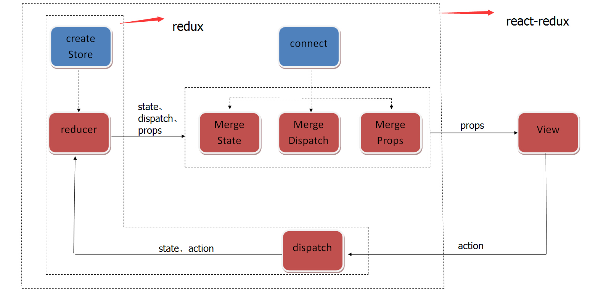

先推荐下我的基于mobx的react服务端渲染解决方案：
Github: [https://github.com/LukeLin/universal-react-mobx](https://github.com/LukeLin/universal-react-mobx)

支持单页，多页服务端渲染。


## Mobx介绍：

#### Anything that can be derived from the application state, should be derived. Automatically.

意思是：一切能从应用状态派发的都应该自动派发。

mobx提供了存储和更新应用状态的机制，与React组合使用是一组非常强大的组合，我们只需要更新应用状态，react就会自动渲染，而且渲染性能很高效。

## 与Redux比较：

Redux是一个状态管理容器，它通过把状态组织成一整棵状态树，当某个状态被修改，就会生成新的状态树。Redux的机制使得我们的状态可被预测和恢复，于是可以做到日志记录，各个时间段状态查看，让我们将应用状态一切掌握在手中。

### Redux和React结合使用
下面举个官方给的todoList为例：
代码就不一一贴出来，请查看[Redux官方Todo例子](http://cn.redux.js.org/docs/basics/ExampleTodoList.html)

Redux和React-Redux运行原理：


下面说下个人认为是Redux的缺点的地方：
#### 缺点1. 编写action和reducer的代码比较麻烦，通常要切换不同文件。
Redux通过action和reducer来改变store，这就意味着我们每增加一个新功能就需要编写对应的action和reducer。
从上面可以看出一个非常简单的todoList如果用Redux来写会显得很复杂，我们需要触发action，然后在更变reducer的时候需要找到数据对应的位置进行更改。相信很多用Redux写列表状态变化的开发者都会觉得为什么Redux把这些搞得这么复杂。

#### 缺点2：因为Redux是基于状态树变化生成新的状态树，导致不必要的组件渲染。
Redux的状态树变化就会生成新的状态树，意味着从发生变化的节点到根节点都会生成新的引用，这就导致组件会造成不必要的渲染，虽然使用shouldComponentUpdate可以解决这个问题，但shouldComponent自身也会有计算损耗，而且shouldComponent解决不了store变化根组件一定会重复渲染的问题。

#### 缺点3：开发成本变高，相应的维护成本也变高。
Redux希望你尽量扁平化数据，这样方便在reducer里面操作，但往往后端人员并不会给你设计扁平化数据，就算使用normalize也使得开发成本变高。

### Mobx使一切变得非常简单
不了解Mobx？可以看下它的[文档](http://mobxjs.github.io/mobx/index.html)
Mobx不但解决了Redux上面列出的三个问题，还使得一切变得简单。
同样是todoList的例子，我们来看看mobx怎么写


## Mobx的使用：
store.js
``` javascript
import {
    observable,
    computed,
    extendObservable,
    action,
    runInAction,
    asFlat
} from 'mobx';

import TodoModel from '../models/TodoModel';

class TodoStore {
    // only the children of the value becomes observable
    @observable todos = asFlat([]);

    @computed get unfinishedTodoCount() {
        return this.todos.filter(todo => !todo.finished).length;
    }

    constructor(state = {}) {
        // required in strict mode to be allowed to update state:
        runInAction('initialize TodoStore', () => {
            extendObservable(this, state);
        });
    }

    @action
    addTodo(todo) {
        todo && this.todos.push(todo);
    }

    @action
    removeTodo(index){
        this.todos.splice(index, 1);
    }

    static fromJS(state) {
        if(state && state.todos) {
            let todoStore = new TodoStore({
                todos: state.todos.map(item => TodoModel.fromJS(item))
            });
            return todoStore;
        }
    }
}

export default TodoStore;

```

TodoModel
``` javascript
import {
    observable,
    extendObservable,
    action,
    runInAction
} from 'mobx';

class TodoModel {
    id;
    @observable title = '';
    @observable finished = false;

	constructor(data) {
        runInAction('initialize TodoModel', () => {
            extendObservable(this, data);
        });
	}

    @action
    setFinished(finished) {
        this.finished = finished
    }

    static fromJS(object) {
        return new TodoModel(object);
    }
}

export default TodoModel;

```
Mobx是经典的面向对象思想，我们通过更改对象的值，Mobx就会自动触发行为。这里面使用的"@action"装饰器是为了在useStrict模式下安全地修改数据。
在上面的代码还看不出Mobx的明显优势，但我们和React结合使用就会发现比Redux简直简单方便N倍。

## 与React组合：
通过mobx-react，我们可以非常方便的把Mobx运用到React上
下面是TodoList的组件例子：
TodoList.jsx
``` javascript
import React, { Component } from 'react';
import { observer } from 'mobx-react';
import Base from '../../pages/Base';

import Todo from './Todo';
import TodoModel from '../../models/TodoModel.js';

@observer
class TodoList extends Base {
    constructor(props, context) {
        super(props, context);

        // this.addTodo = this.addTodo.bind(this);
        // this.removeTodo = this.removeTodo.bind(this);
    }

    onAddTodo(e) {
        e.preventDefault();

        let { todoList } = this.props;

        todoList.addTodo(new TodoModel({
            id: todoList.todos.length,
            title: 'some text' + todoList.todos.length
        }));
    }

    onRemoveTodo(e, index){
        e.preventDefault();

        let { todoList } = this.props;

        todoList.removeTodo(index);
    }

    render() {
        let { todoList } = this.props;

        return (
            <div>
                <ul>
                    {todoList.todos.map((todo, index) => {
                        return (
                            <Todo todo={todo}
                        index={ index }
                            key={todo.id} 
                            addTodo={this.onAddTodo}
                            removeTodo={ this.onRemoveTodo }/>
                        );
                    })}
                </ul>
                Tasks left: {todoList.unfinishedTodoCount}
            </div>
        );
    }
}

export default TodoList;

@observer
class Todo extends Base {
    constructor(props, context) {
        super(props, context);

        // this.onChange = this.onChange.bind(this);
        // this.removeTodo = this.removeTodo.bind(this);
    }

    onChange() {
        let {todo} = this.props;

        todo.setFinished(!todo.finished)
    }

    onRemoveTodo(e){
        this.props.removeTodo(e, this.props.index);
    }

    render() {
        let {todo, index} = this.props;

        return (
            <li>
                <input
                    type="checkbox"
                    checked={todo.finished}
                    onChange={ this.onChange }
                />{todo.title}
                <button onClick={ this.props.addTodo }>add</button>
                <button onClick={ this.onRemoveTodo }>remove</button>
            </li>
        );
    }
}

```


## 服务端渲染：
1. 服务端渲染需要注意的地方在于使用"@observer"的时候，我们需要小心造成组件不断地侦听事件，造成内存泄漏的情况。好在mobx-react提供了针对服务端渲染的支持，通过“useStaticRendering(true)”可以预防内存泄漏。
2. 客户端首次初始化数据的时候需要把JSON数据转换成对应Store实例。通过上面自定义的静态方法fromJS，我们内部将数据实例化一次即可。
3. 同构请求数据。怎么更好的解决同构请求和区分内外网调用？
我封装了一个高阶组件用来请求首次页面显示需要的数据，通过这个高阶组件我们可以非常方便的进行同构请求，而内外网调用可以使用package.json配置“main”和“browser”字段区分前后端调用。

## 总结：
Mobx提供了更简单和伸缩的状态管理，我们只需要更改状态就会自动触发组件渲染。它使我们开发效率更快，开发过程变得更简单了。
Mobx相比Redux的劣势就是我们不能像Redux那样将状态一切掌握，在调试和排查问题方面没有Redux方便。Mobx也像Redux一样提供了方便调试的devTools的功能。它能够精准控制需要渲染的组件，而且没有像Redux传递渲染的问题。
虽然目前Mobx还没Redux火热，但我相信未来Mobx会有很大的潜力。

需要了解更多关于mobx和react的解决方案可以参考下下面链接：
[https://github.com/LukeLin/universal-react-mobx](https://github.com/LukeLin/universal-react-mobx)

另外推荐一篇关于Mobx和React构建高性能应用的文章：
[https://www.mendix.com/tech-blog/making-react-reactive-pursuit-high-performing-easily-maintainable-react-apps/](https://www.mendix.com/tech-blog/making-react-reactive-pursuit-high-performing-easily-maintainable-react-apps/)
