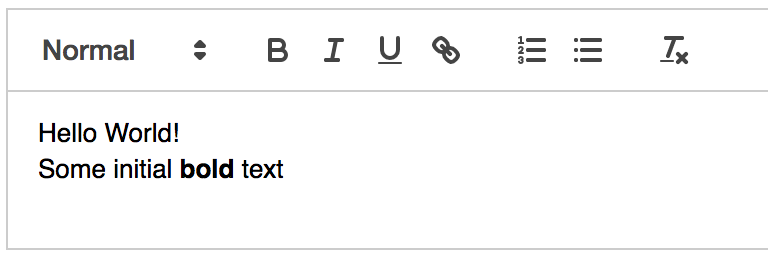
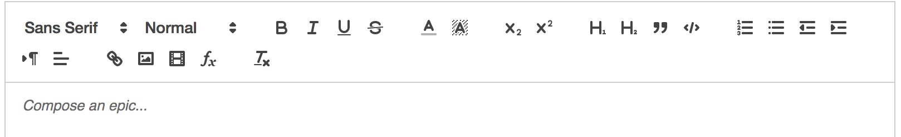

## 介绍
近期在弄富文本编辑器相关的内容，其中项目中使用了[Quill Editor](https://quilljs.com)（后面简称Quill）。Quill自称是一个现代化强大的富文本编辑器，它与其它富文本编辑器（例如UEditor）不同的地方在于，过去的编辑器操作的数据和展现给用户的视图层是同一份HTML／DOM，HTML是树状结构，显然树状结构不如线性结构好处理，而Quill内部就是通过使用线性结构的方式使操作富文本编辑器变得简单，而且数据层和视图层分离，这让Quill对现在很流行的React、Vue或者Angular都能很好的支持。下面我简单介绍下Quill的使用：
<!--more-->

## 简单的上手
``` html
<!DOCTYPE html>
<html lang="en">

<head>
    <meta charset="UTF-8">
    <meta name="viewport" content="width=device-width, initial-scale=1.0">
    <meta http-equiv="X-UA-Compatible" content="ie=edge">
    <title>Quick Start</title>
    <link href="https://cdn.quilljs.com/1.3.2/quill.snow.css" rel="stylesheet">
</head>

<body>
    <div id="editor">
        <p>Hello World!</p>
        <p>Some initial <strong>bold</strong> text</p>
        <p><br></p>
    </div>

    <script src="https://cdn.quilljs.com/1.3.2/quill.js"></script>
    <script>
        var quill = new Quill('#editor', {
            theme: 'snow'
        });
    </script>

</body>

</html>
```

通过上面几行代码，我们就可以在浏览器里面看到一个简单的但又可以满足基本的富文本编辑器。


当然上面只是一个非常简单的文本编辑器，而Quill内置支持了很多富文本操作功能，它既提供了UI控制也提供了API操作。下面是一个完整的Quill自带的编辑器功能：

通过上图我们可以看到这些功能其实已经基本满足日常的富文本编辑需求了。

另外Quill提供了两套风格的主题以及常用的富文本编辑器模块：
1. 工具栏
2. 快捷键绑定
3. 历史记录
4. 剪贴板
5. 公式
6. 语法高亮

我们可以在初始化的时候对模块进行自定义的配置或者对模块进行扩展操作，具体文档可以查看：
[Quill Modules](https://quilljs.com/docs/modules/)

最后Quill也和其它文本编辑器一样提供了操作api：
[https://quilljs.com/docs/api/](https://quilljs.com/docs/api/)

到这里我们还没看出Quill和其它富文本编辑器有什么区别，因为这才是刚刚开始，下面我会介绍Quill的独特功能。

## Delta
前面说到HTML是树型结构，树型结构处理起来比较麻烦，而Quill通过变通引入了一个**Delta**的概念。
Delta是用来描述富文本内容的一种简单的JSON格式。通过Delta我们就算不需要DOM／HTML也可以描述文本和格式化内容，甚至还可以描述文本内容。
而且Delta是线性结构的数据，因此操作更简便。
下面是一个使用Delta描述的富文本内容：
``` javascript
{
  ops: [
    { insert: 'Gandalf', attributes: { bold: true } },
    { insert: ' the ' },
    { insert: 'Grey', attributes: { color: '#cccccc' } }，
    { insert: '\n', attributes: { header: 1 } }
  ]
}
```
通过上面的描述，我们可以很清晰地知道有这么一段文本“Gandalf the Grey”，其中“Gandalf”是加粗的，还有“Grey”的颜色值是“#ccc”，最后一个“\n”就是代表换行，这里需要注意的是，如果换行这里也有attributes，这在Quill里面表示的是当前行的格式，这里表示这段文字是被h1标签包裹的。

通过Delta来描述富文本内容，我们就可以摆脱使用HTML来描述富文本内容的困境。
另外Delta还可以描述富文本内容变化，还是“Gandalf the Grey”这段文本作为例子：
``` javascript
{
  ops: [
    // "Gandalf"斜体和不加粗
    { retain: 7, attributes: { bold: null, italic: true } },

    // " the "保留不变
    { retain: 5 },

    // 插入"White"，颜色值为#fff
    { insert: "White", attributes: { color: '#fff' } },

    // 删除"Grey"
    { delete: 4 }
  ]
}
```
学习Delta的概念很重要，因为如果我们需要增加一些定制化的功能，极有可能需要操作Delta。
详细有关Delta的介绍可以参考官网这里
[https://quilljs.com/guides/designing-the-delta-format/](https://quilljs.com/guides/designing-the-delta-format/)
[https://quilljs.com/docs/delta/](https://quilljs.com/docs/delta/)

## blots & Parchment
Quill里面有个blots的概念，想象一下，一段文字是一个段落，属于块状元素，该段落可以包含以下几种基础元素：
- 块状元素(Block)，例如标题；块状样式，例如行高，缩进，居中等；
- 纯文本内容(Text)，是个叶子结点；
- 内联元素(Inline)，例如<b></b><i></i>等；内联样式，例如文字颜色，文字大小等；
- 非文本叶子结点(Embed)，例如图片，视频；
而blots就是由这些类型组合，实际上在Quill里面这些分类统称Parchment，
Parchment主要作用就是操作文档模型。Quill里面的blots都是通过继承Parchment里面的类来进行扩展。
举个例子，例如我想自己实现一个添加链接和加粗功能，我可以通过使用Parchment来实现这个功能：
``` javascript
let Inline = Quill.import('blots/inline');

class BoldBlot extends Inline { }
BoldBlot.blotName = 'bold';
BoldBlot.tagName = 'strong';

class LinkBlot extends Inline {
  static create(url) {
    let node = super.create();
    // Sanitize url if desired
    node.setAttribute('href', url);
    // Okay to set other non-format related attributes
    node.setAttribute('target', '_blank');
    return node;
  }
  
  static formats(node) {
    // We will only be called with a node already
    // determined to be a Link blot, so we do
    // not need to check ourselves
    return node.getAttribute('href');
  }
}
LinkBlot.blotName = 'link';
LinkBlot.tagName = 'a';

Quill.register(BoldBlot);
Quill.register(LinkBlot);

let quill = new Quill('#editor-container');

$('#bold-button').click(function() {
  quill.format('bold', true);
});

$('#link-button').click(function() {
  let value = prompt('Enter link URL');
  quill.format('link', value);
});
```
熟练使用Parchment对我们日后如果需要新增Quill没有的功能或者个性化的功能非常有用（同时也是必须）。
Parchment有关的资料：
[https://quilljs.com/guides/cloning-medium-with-parchment/](https://quilljs.com/guides/cloning-medium-with-parchment/)
[https://github.com/quilljs/parchment](https://github.com/quilljs/parchment)

## 总结
